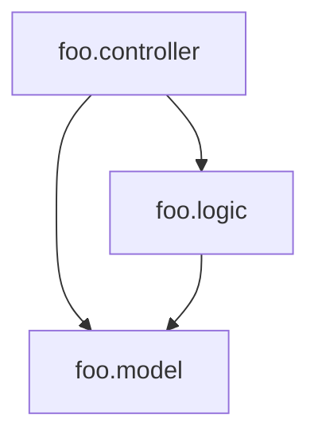

# clj-depend

A Clojure namespace dependency analyzer.

> ⚠️ Not ready, still in development.

## Usage

Add `[clj-depend "0.1.0"]` to `:plugins`.

```
$ lein clj-depend
```

## Configuration

To let clj-depend know the existing layers in your application and the allowed dependencies between these layers, create a `.clj-depend` directory at the root of the project and inside it a `config.edn` file.

### Layer Checks



```clojure
{:layers {:controller {:defined-by         ".*\\.controller\\..*"
                       :accessed-by-layers #{}}
          :logic      {:defined-by         ".*\\.logic\\..*"
                       :accessed-by-layers #{:controller}}
          :model      {:defined-by         ".*\\.model\\..*"
                       :accessed-by-layers #{:logic :controller}}}}
```
