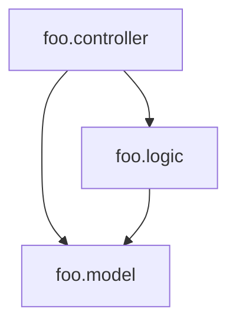

[](http://clojars.org/com.fabiodomingues/clj-depend)

# clj-depend

A Clojure namespace dependency analyzer.

## Usage

### Leiningen

To run clj-depend from Leiningen, check [lein-clj-depend](https://github.com/clj-depend/lein-clj-depend) plugin.

### Clojure CLI (tools.deps)

Add clj-depend as a dependency, preferably under an alias in `deps.edn`.

```clojure
{:deps { ,,, }
 :aliases {:clj-depend {:extra-deps {com.fabiodomingues/clj-depend {:mvn/version "0.6.0"}}
                        :main-opts ["-m" "clj-depend.main"]}}}
```

Run:

```
clj -M:clj-depend
```

### API

You can use the namespace [clj-depend.api](https://cljdoc.org/d/com.fabiodomingues/clj-depend/CURRENT/api/clj-depend.api) to have access to all clj-depend features.

## Configuration

To let clj-depend know the existing layers in your application and the allowed dependencies between these layers, create a `.clj-depend` directory at the root of the project and inside it a `config.edn` file.

### Layer Checks

Diagram to exemplify the dependency between layers:



Configuration file (`.clj-depend/config.edn`) for diagram above:

```clojure
{:source-paths #{"src"}
 :layers {:controller {:defined-by         ".*\\.controller\\..*"
                       :accessed-by-layers #{}}
          :logic      {:defined-by         ".*\\.logic\\..*"
                       :accessed-by-layers #{:controller}}
          :model      {:defined-by         ".*\\.model\\..*"
                       :accessed-by-layers #{:logic :controller}}}}
```
