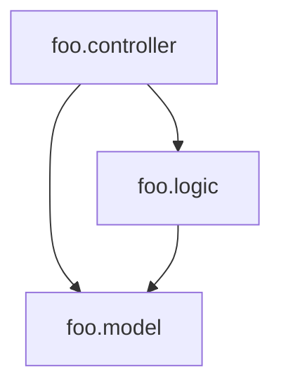

[](http://clojars.org/com.fabiodomingues/clj-depend)

# clj-depend

A Clojure namespace dependency analyzer.

## Usage

Add `[com.fabiodomingues/clj-depend "0.2.0"]` to `:plugins`.

```
$ lein clj-depend
```

In case any cyclic dependency is found the analysis will fail with the error message: `Circular dependency between "foo" and "bar"`.

## Exit codes

- 0: no violations were found
- 1: one or more violations were found
- 2: error during analysis

## Configuration

To let clj-depend know the existing layers in your application and the allowed dependencies between these layers, create a `.clj-depend` directory at the root of the project and inside it a `config.edn` file.

### Layer Checks

Diagram to exemplify the dependency between layers:



Configuration file (`.clj-depend/config.edn`) for diagram above:

```clojure
{:source-paths #{"src"}
 :layers {:controller {:defined-by         ".*\\.controller\\..*"
                       :accessed-by-layers #{}}
          :logic      {:defined-by         ".*\\.logic\\..*"
                       :accessed-by-layers #{:controller}}
          :model      {:defined-by         ".*\\.model\\..*"
                       :accessed-by-layers #{:logic :controller}}}}
```
